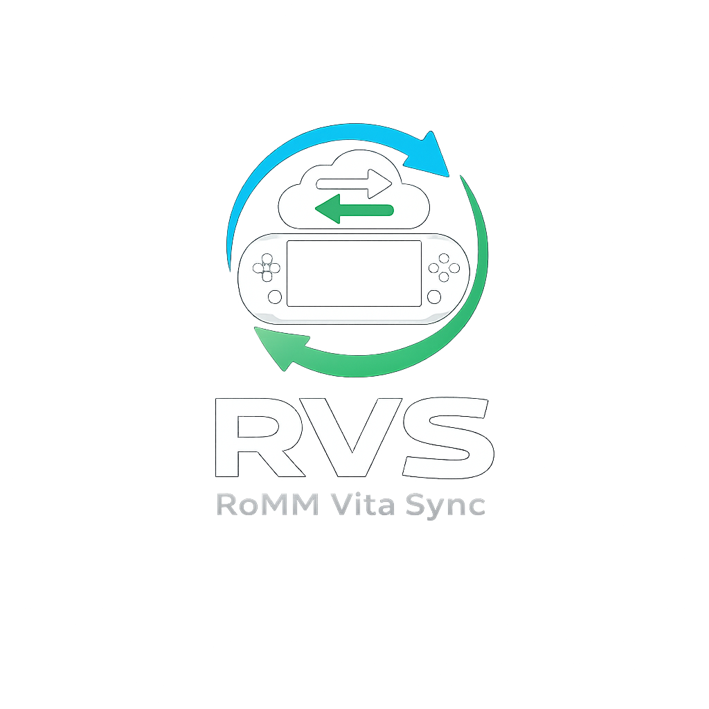
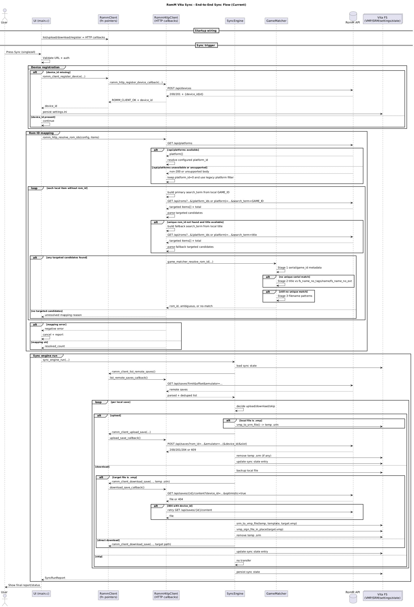

# romm-vita-sync

<p align="center">
    
</p>

Save synchronization client for RomM on PlayStation Vita, supporting native and emulated platforms.

## Overview

**romm-vita-sync** is a PlayStation Vita homebrew application designed to synchronize game save data with a RomM server.

The long-term objective is cross-platform save synchronization across:

- PS Vita native games
- PSP (Adrenaline)
- PS1 (POPS via Adrenaline)
- RetroArch and other emulator environments

The first milestone targets PS1 save synchronization using Adrenaline virtual memory cards.

The first implementation targets a manual synchronization workflow executed from a dedicated homebrew application.
An optional startup auto-sync path is also available in-app (`[Sync].auto_sync_on_startup = true`) and uses persistent on-screen progress feedback.
Automatic trigger integration from system plugin events remains planned for a later stage.

## Project Status

**Stage:** early development

This project is in early development. Back up your save data before installation or any manipulation.

Documentation scope:

- unless a section is explicitly labeled `Planned`, `Roadmap`, `Future Work`, or `Design Notes`, it describes the current codebase
- ideas and possible future refactors are kept separate from implemented behavior on purpose
- when documentation and code disagree, the code is the reference for current behavior until both are brought back in sync

Initial milestone includes:

- Detect PS1 save folders under `ux0:/pspemu/PSP/SAVEDATA`
- Parse `PARAM.SFO`
- Detect `SCEVMC0.VMP` and `SCEVMC1.VMP`
- Display metadata (path, size, timestamp)
- Convert `.VMP` → `.SRM`
- Convert `.SRM` → `.VMP`
- Compare local vs remote saves
- Select only the newest local PS1 card per game before sync; exact timestamp ties default to `SCEVMC0.VMP` with a warning
- Manual synchronization workflow
- Synchronization is triggered manually from the application UI in this phase, with optional startup auto-sync (`auto_sync_on_startup`)
- Automatic backup before overwrite
- Zero destructive operations without confirmation

Current integration status:

- real HTTP device registration is implemented (`POST /api/devices`)
- upload/download conversion logic is integrated in `SyncEngine`
- real HTTP save transfer callbacks are wired (`list/upload/download`)
- local Vita saves are now mapped to RomM `rom_id` by trying `/api/platforms` first, then querying `/api/roms` with targeted `search_term` requests using `GAME_ID` first and `title` as fallback


## Execution Model (Version 1)

romm-vita-sync is implemented first as a standalone PS Vita homebrew application.

Synchronization is explicitly triggered by the user from within the application UI.

This approach ensures:

- safe validation of save conversion logic
- deterministic synchronization behavior
- easier debugging during early development
- reduced risk of unintended save overwrites

Automatic synchronization based on system events (for example after exiting a game) will be introduced later through a taiHEN plugin once the synchronization engine is fully validated.

## Installation & Quick Start

This section summarizes the practical setup for both end users and developers.

### End User Prerequisites

- PlayStation Vita with homebrew support
- VitaShell (or equivalent method to install VPK files)
- Adrenaline installed (for PS1 save support)
- Network access from Vita to your RomM server
- Valid RomM username/password credentials

### Developer Build Prerequisites (Recommended: Docker)

- Docker Engine / Docker Desktop installed
- Docker daemon running
- Git with submodules support

### Host Toolchain Prerequisites (Alternative)

- VitaSDK toolchain
- CMake
- Git with submodules support
- `curl` (or `curl.exe` on Windows)

### Upload Target Configuration (Vita FTP)

The build/upload helpers read optional FTP settings from:

`tools/build-and-upload-vpk.local.env`

Create it from the sample template:

- Linux/macOS: `cp tools/build-and-upload-vpk.config.sample.env tools/build-and-upload-vpk.local.env`
- Windows PowerShell: `Copy-Item tools/build-and-upload-vpk.config.sample.env tools/build-and-upload-vpk.local.env`

Supported keys:

- `FTP_HOST`: Vita IP address (for example `192.168.1.20`)
- `FTP_PORT`: VitaShell FTP port (default `1337`)
- `FTP_REMOTE_DIR`: remote destination directory (default `ux0:/homebrews`)

CLI arguments still override values from the local env file.

### Recommended Build + Upload (Docker One-Command)

1. `git submodule update --init --recursive`
2. Linux/macOS: `./tools/docker-build-and-upload-vpk.sh`
3. Windows PowerShell: `./tools/docker-build-and-upload-vpk.ps1`

The FTP upload step uses an explicit timeout policy:

- connection timeout: `10s`
- upload stall timeout: `10s` (if speed drops below `1 B/s`)
- container lifecycle: `--rm` (container auto-stopped and removed when script exits)

### Host Toolchain Alternative

Use this method if you prefer a native VitaSDK setup on the host machine.

Commands:

1. `git submodule update --init --recursive`
2. Linux/macOS: `./tools/build-and-upload-vpk.sh`
3. Windows PowerShell: `./tools/build-and-upload-vpk.ps1`

### First Launch

1. Launch the app on Vita
2. The app automatically creates `ux0:data/romm-vita-sync/`
3. Select the connection fields and enter the RomM `url`, `username`, and `password`
4. Optionally toggle `Dry-run mode` before the first sync
5. Confirm each field saves immediately after closing the system keyboard

### First Sync

1. Ensure Vita can reach the RomM URL
2. In the game list, choose a detected PS1 game
3. Return to `Synchronize Selected Game` and press the system confirm button (`X` or `O`)
4. Follow progress in the sync modal for manual runs; automatic startup sync updates the header state and `Synchronize` panel status without opening a modal

Notes:

- The RomM URL, username, and password are currently stored in plain text (no encryption) in `settings.ini`.
- Default `dry_run = true`; you can disable it directly from the home screen or set `[Sync].dry_run = false` in `settings.ini` to execute real transfers.
- Conflict auto-apply is always enabled internally so recommended conflict actions run automatically.

## Configuration (`settings.ini`)

Connection and sync runtime options are read from:

`ux0:data/romm-vita-sync/settings.ini`

Format is INI-style (conventional in C/C++ desktop and embedded projects).

The app now creates `ux0:data/romm-vita-sync/` automatically on startup.
You can configure the URL, username, password, and dry-run mode directly in the in-app UI; manual file creation is not required.

Reference template (optional, for manual editing/debug):

`samples/settings.ini.example`

Supported sections:

- `[RomM]`: `url`, `username`, `password`, `platform`, `emulator`, `verify_tls`, `timeout_seconds`
- `[Device]`: `device_id`, `device_name`, `device_platform`, `client`, `client_version`
- `[Sync]`: `state_store_path`, `backup_directory`, `dry_run`, `auto_sync_on_startup`
- `[Log]`: `level` (`error|warn|info|debug`), `file_enabled` (`true|false`), `scan_verbose` (`true|false`)

### Sync State Store (`sync_state.tsv`)

Default path:

`ux0:data/romm-vita-sync/sync_state.tsv`

Purpose:

- persist local synchronization metadata between runs
- remember the last known state for one save key (`game_id` + `filename` + `slot`)
- help the sync engine skip redundant uploads when local size and timestamp are unchanged and no remote match is found
- track the recorded origin device and the last upload timestamp associated with that save entry

What it stores:

- one format/version header
- the current `device_id` when available
- one tab-separated entry per tracked save with `game_id`, `filename`, `slot`, `size_bytes`, `timestamp_unix`, `origin_device`, and `last_upload_unix`

Operational notes:

- if the file is missing, the app treats it as an empty sync state rather than an error
- deleting `sync_state.tsv` does not delete any save data; it only resets the local sync history
- after deletion, the next synchronization behaves like a first pass and may re-evaluate or repeat transfers that would otherwise have been skipped
- this file is metadata only; it is not a backup and it does not contain the actual save payload

Security notice:

- The RomM URL, username, and password are currently stored locally in `settings.ini` **without encryption** (plain text).
- This is intentional for the current milestone and will be hardened in a later iteration.

Authentication rule:

- `username` and `password` are required for all authenticated RomM requests
- if `[Device].device_id` is empty, startup calls the `RommClient` registration flow and persists the returned `device_id` into `settings.ini`
- recommended logging for troubleshooting: `level=debug` and keep `scan_verbose=false` first; enable `scan_verbose=true` only when debugging scanner issues
- at `level=info`, RomM HTTP logs summarize request/response flow for `/api/platforms`, `/api/roms`, `/api/saves`, and `/api/devices`
- HTTP error responses now log richer diagnostics automatically: effective URL/scheme, selected response headers (`Content-Type`, `Server`, `Via`, `Location`, `CF-Ray` when present), and a longer body preview
- at `level=debug`, additional raw response-body details remain available for troubleshooting unsupported API payloads
- file logging remains available only through `settings.ini`; the home screen no longer exposes a dedicated file logging row
- when enabled manually, file logging path is fixed to `ux0:data/romm-vita-sync/romm-vita-sync.log` with 3 rotated files max (`.log`, `.log.1`, `.log.2`), 10MB each

Current in-app UI behavior:

- The home screen exposes dedicated fields for the RomM `url`, `username`, and `password`.
- The home screen includes a `Dry-run mode` toggle with immediate save.
- Editing those fields opens the official PS Vita system keyboard (`SceImeDialog`).
- Confirming keyboard input persists values immediately to `ux0:data/romm-vita-sync/settings.ini`.
- The main screen keeps a visible primary `Synchronize Selected Game` action plus secondary `Synchronize All Saves` and `Rescan Local Saves` actions.
- The current sync target is selected from the detected PS1 game list and remains highlighted even when focus moves back to the sync button.
- The main screen uses three larger panels (`Connection`, `Synchronize`, `Detected PS1 Games`) instead of a separate sync-activity side panel.
- Connection values wrap inside their rows, and long single-line labels such as game-list entries and footer status text ellipsize to stay inside their bounds.
- Manual sync runs now open a blocking modal with a wider layout, wrapped text, a real progress bar, and live scrolling logs.
- While a manual sync is running, the modal cannot be closed; once complete, it shows success/failure and can be closed manually.
- Manual sync logs support held `UP/DOWN` scrolling after the viewport leaves auto-follow mode, and they can also be dragged with the front touchscreen.
- Recommended conflict actions execute automatically without exposing a dedicated conflict toggle in the home screen.
- Automatic startup sync keeps using the same sync pipeline, but its live state is now reflected through the header status and `Synchronize` panel messaging on the home screen.
- The current UI uses a sober single-screen Vita layout with wider panels, clearer spacing, controller navigation, and sharper text placement.

The sync engine now treats server `409 Conflict` responses as synchronization conflicts (remote newer) rather than generic transfer errors, aligned with `romm-retroarch-sync` behavior.

## Test End-to-End (Current Milestone)

Coverage:

- local PS1 save scan
- config loading/persistence
- real device registration via `POST /api/devices`
- per-game sync triggering from the Vita UI
- visible sync/log output on-device
- in-app conversion path wiring (`VMP->SRM` for upload, `SRM->VMP` + signing for download)
- real save transfer integration (`GET /api/saves`, `POST /api/saves`, `PUT /api/saves/{id}`, `GET /api/saves/{id}/content`)

### 1. Build And Upload VPK

Docker one-command method (recommended):

1. `git submodule update --init --recursive`
2. Create `tools/build-and-upload-vpk.local.env` from `tools/build-and-upload-vpk.config.sample.env` and set `FTP_HOST` (Vita IP), optional `FTP_PORT`, and optional `FTP_REMOTE_DIR`
3. Linux/macOS: `./tools/docker-build-and-upload-vpk.sh`
4. Windows PowerShell: `./tools/docker-build-and-upload-vpk.ps1`

Host toolchain alternative:

1. Ensure VitaSDK/CMake/curl are installed on the host
2. `git submodule update --init --recursive`
3. Linux/macOS: `./tools/build-and-upload-vpk.sh`
4. Windows PowerShell: `./tools/build-and-upload-vpk.ps1`

### 2. First Launch Setup

1. Launch the app on Vita.
2. Confirm the app creates `ux0:data/romm-vita-sync/`.
3. Select each connection field and enter the RomM `url`, `username`, and `password`.
4. Confirm that each field saves immediately after closing the system keyboard.
5. Toggle `Dry-run mode` directly from the home screen if you want to execute real transfers immediately.

### 3. Network And Auth Preconditions

1. Ensure Vita can reach the RomM URL on the same network.
2. Use valid RomM username/password credentials.
3. For self-signed HTTPS certificates, use `verify_tls = false` only for local testing.

### 4. Sync Validation

1. Move through the detected PS1 game list to choose the current sync target.
2. Return to `Synchronize Selected Game` and press the system confirm button (`X` or `O`).
3. Confirm manual sync shows a blocking progress modal with live logs and completion state.
4. Confirm automatic startup sync (when enabled) updates the header state and `Synchronize` panel without opening a modal.
5. On first successful authenticated sync, confirm `device_id` is persisted in `settings.ini`.

### 5. Persistence Validation

1. Restart the app.
2. Confirm URL/username/password are still present and `Dry-run mode` keeps its saved value.
3. Confirm `device_id` remains stable across launches.

### 6. Negative Path Validation

1. Invalid username/password: expect `authentication failed`.
2. Unreachable URL/network issue: expect `network error`.
3. HTTPS with invalid cert and `verify_tls = true`: expect request failure.

### 7. `dry_run` Validation

1. Default is `dry_run = true` for safety-first runs.
2. Set `[Sync].dry_run = false` in `settings.ini` to execute real transfers.
3. Upload flow sends `.SRM` through `POST /api/saves` for new remote saves and `PUT /api/saves/{id}` when a matching remote save already exists; download flow pulls `GET /api/saves/{id}/content` then rebuilds/signs `.VMP`.

### 8. Conflict Auto-Apply Behavior

1. Conflict auto-apply is enabled by default and not exposed as a home-screen toggle.
2. Recommended conflict actions run automatically during both manual sync and startup auto-sync.

## Why This Project Exists

RomM already supports save synchronization for several platforms and clients (for example Android launchers). However, there is currently no native PS Vita sync client.

This project aims to provide:

- reliable save backup
- bidirectional synchronization with RomM
- conflict-safe restore workflows
- compatibility with Adrenaline-based PS1 saves

## Scope (Version 1)

Version 1 focuses exclusively on PS1 saves via Adrenaline.

Features:

- Detect save folders in `ux0:/pspemu/PSP/SAVEDATA/<GAME_ID>`
- Parse `PARAM.SFO`
- Detect `.VMP` memory card files
- Convert `.VMP` → `.SRM`
- Convert `.SRM` → `.VMP`
- Support manual upload/download workflow orchestration in `SyncEngine` with real RomM HTTP transport
- Always create backups before overwrite

## PS1 Save Architecture

### Local PS Vita / Adrenaline Layout

PS1 saves are stored inside:

`ux0:/pspemu/PSP/SAVEDATA/<GAME_ID>/`

Typical contents:

- `PARAM.SFO`
- `ICON0.PNG`
- `CONFIG.BIN`
- `SCEVMC0.VMP`
- `SCEVMC1.VMP`

File roles:

| File | Purpose |
|------|---------|
| PARAM.SFO | Sony metadata |
| ICON0.PNG | Save icon |
| CONFIG.BIN | POPS configuration |
| SCEVMC0.VMP | Memory card slot 1 |
| SCEVMC1.VMP | Memory card slot 2 |

Adrenaline / POPS stores PS1 saves as virtual memory card containers.

### RomM / Emulator-Side Layout

RomM stores PS1 saves as `.SRM` files:

`.../saves/psx/<rom_id>/pcsx_rearmed/<game>.srm`

RomM does not store `.VMP` containers directly. Instead, it uses emulator-facing raw save formats.

### VMP vs SRM Relationship

Observed sizes:

- `SCEVMC0.VMP = 131200 bytes`
- Standard `SAVE.SRM = 131072 bytes` (pcsx_rearmed, DuckStation, and most PS1 emulators)
- Dual-card `SAVE.SRM = 262144 bytes` (mednafen_psx_hw / beetle_psx only)

Working model:

- VMP = 128-byte header + raw memory card data (one card, 131072 bytes)
- SRM = raw memory card data; standard format is 131072 bytes (single card)

Conversion strategy:

| Direction | Operation |
|-----------|-----------|
| Vita → RomM | Remove 128-byte VMP header, producing a standard 131072-byte SRM |
| RomM → Vita | Single-card SRM: rebuild one VMP. Dual-card SRM: split into card 1 + card 2 and rebuild both `SCEVMC0.VMP` and `SCEVMC1.VMP` |

The upload produces the standard 131072-byte single-card SRM format, which is compatible
with pcsx_rearmed (EmulatorJS default), DuckStation, and other PS1 emulators.
The download path accepts both 131072-byte and 262144-byte SRM files for compatibility
with saves created by mednafen_psx_hw users. When a dual-card SRM is downloaded,
the app restores both PS1 memory cards on Vita instead of dropping card 2.

## Save Models (Current Implementation)

The current PS1 implementation does not use a single `LocalPs1Save` struct. The codebase uses three concrete representations instead, depending on the stage of the pipeline.

### Scanner Inventory (`SaveItem`)

Defined in `src/save_item.h`.

```
SaveItem
├─ game_id
├─ game_title
├─ path
├─ size_bytes
└─ timestamp
```

Notes:

- one `SaveItem` represents one detected `.VMP` file, not one aggregated save directory
- `game_id` is extracted from the parent directory name
- `game_title` is read from `PARAM.SFO` when available
- `path` points directly to the detected `.VMP` file
- `timestamp` is stored as a formatted sync timestamp string (`YYYY-MM-DD HH:MM:SS`)

### Sync Inventory (`SyncSaveDescriptor`)

Defined in `src/sync_types.h`.

```
SyncSaveDescriptor
├─ rom_id
├─ remote_id
├─ game_id
├─ title
├─ filename
├─ path
├─ remote_path
├─ size_bytes
├─ timestamp_unix
├─ hash
├─ origin_device
├─ device_is_current
├─ device_is_untracked
└─ slot
```

Notes:

- local scan results are converted from `SaveItem` into `SyncSaveDescriptor` by `src/scan_to_sync_adapter.c`
- remote saves fetched from RomM are also parsed into `SyncSaveDescriptor`
- this shared descriptor is the canonical synchronization model currently used by `SyncEngine`
- `slot` is inferred from `SCEVMC0.VMP` or `SCEVMC1.VMP`
- before RomM mapping and transfer decisions, local descriptors are grouped per `game_id` and only the newest local card remains eligible for sync
- when two local cards from the same game share the exact same timestamp, `SCEVMC0.VMP` wins deterministically and the UI shows a warning

### UI Game Aggregation (`UiGameEntry`)

Defined in `src/main.c`.

```
UiGameEntry
├─ key
├─ game_id
├─ title
└─ save_count
```

Notes:

- the UI groups multiple `SyncSaveDescriptor` items by game to render the selectable PS1 game list
- `save_count` is the number of detected memory-card files associated with that game

### Design Notes (Not Implemented Yet)

The current codebase does not yet expose:

- a dedicated directory-level `LocalPs1Save` model with `save_dir`, `icon_path`, `config_path`, `vmc0_path`, and `vmc1_path`
- a dedicated `RemotePs1Save` struct separate from `SyncSaveDescriptor`
- a dedicated `CanonicalPs1MemoryCard` struct holding parsed raw card data plus metadata

Those ideas may still be useful later if the project evolves toward a richer per-directory or per-card abstraction, but they are not part of the current implementation.

## Conversion Strategy

### VMP → SRM

Process:

1. Read `SCEVMC0.VMP`
2. Remove first 128 bytes
3. Write `.SRM` payload

CLI helper:

- reusable C module: `src/vmp_srm_converter.c`
- standalone wrapper: `tools/convert-vmp-to-srm.ps1`
- shell wrapper: `tools/convert-vmp-to-srm.sh`
- example (Windows): `.\tools\convert-vmp-to-srm.ps1 .\SCEVMC0.VMP`
- example (Linux/macOS): `./tools/convert-vmp-to-srm.sh ./SCEVMC0.VMP`

The PowerShell script uses the standalone `vmp2srm` tool and can build it automatically into `build-tools/` if needed.

### SRM → VMP

Process:

1. Read `.SRM`
2. Prepend 128-byte VMP header
3. Write `SCEVMC0.VMP`

CLI helper:

- reusable C module: `src/vmp_srm_converter.c`
- standalone wrapper: `tools/convert-srm-to-vmp.ps1`
- shell wrapper: `tools/convert-srm-to-vmp.sh`
- example (Windows): `.\tools\convert-srm-to-vmp.ps1 .\SAVE.SRM .\SAVE.VMP .\SCEVMC0.VMP`
- example (Linux/macOS): `./tools/convert-srm-to-vmp.sh ./SAVE.SRM ./SAVE.VMP ./SCEVMC0.VMP`
- signing: the wrappers always re-sign using `vita-mcr2vmp` (submodule `tools/vita-mcr2vmp`) to avoid checksum error (`80010005`).
- the app now uses the same signing logic directly in `SyncEngine` after `SRM -> VMP` reconstruction.

Required setup:

- `git submodule update --init tools/vita-mcr2vmp`

Build behavior:

- the wrappers look for `srm2vmp` and `vita-mcr2vmp` in `build-tools/`
- if either tool is missing (or `--rebuild` is passed), the wrappers run `cmake -S tools -B build-tools` then `cmake --build build-tools --config Release`
- configuration fails fast when `tools/vita-mcr2vmp` is missing

Usage:

- Linux/macOS: `./tools/convert-srm-to-vmp.sh <INPUT.SRM> [OUTPUT.VMP] <TEMPLATE.VMP>`
- Windows: `.\tools\convert-srm-to-vmp.ps1 <INPUT.SRM> [OUTPUT.VMP] <TEMPLATE.VMP>`
- Slot selection: defaults to slot 0; override with `--slot 0` or `--slot 1` (`-Slot 0|1` on PowerShell). If no output name is provided, the script writes `SCEVMC<slot>.VMP` beside the input.
- The wrappers perform a VMP→MCR→VMP round-trip to recompute the signature with `vita-mcr2vmp` and then replace the unsigned output with the signed VMP.

Rules:

- reuse known-good VMP headers
- never overwrite automatically
- always create backups first

The `SRM -> VMP` wrappers require a known-good `.VMP` template header. Pass an existing Vita/Adrenaline `SCEVMC0.VMP` or `SCEVMC1.VMP`, or set `ROMM_VMP_TEMPLATE_PATH`. Templates are provided in `samples/vmp-templates/`.

## PS1 Sync Pipeline

Candidate selection rule:

- when both `SCEVMC0.VMP` and `SCEVMC1.VMP` exist for the same game, only the local card with the newest modification timestamp is eligible for sync
- when both local timestamps are exactly equal, the app keeps `SCEVMC0.VMP`, skips `SCEVMC1.VMP`, and surfaces a warning to the user before continuing
- remote save listing keeps the single newest RomM save per `rom_id` using `updated_at`, regardless of remote slot metadata
- if the remote/server save is newer and a download is selected, the app overwrites that already-selected local card; it does not switch to the other local slot during the restore path
- backup behavior is unchanged: backups are still mandatory before any local overwrite during download/restore
- sync logs now include the compared timestamps for each detected local save, each selected PS1 candidate, the matched remote candidate, and the remote save chosen for download so `remote_newer` / `local_newer` decisions can be inspected directly

Current sync pseudo-code:

```text
manual_or_auto_sync():
  local_items = scan_local_vmp_files()
  log_detected_local_items(local_items)

  selected_items = select_latest_local_card_per_game(local_items)
  if selected_items is empty:
    fail("no PS1 sync candidate selected")

  ensure_romm_url_and_auth_are_present()
  ensure_device_registration()

  for each item in selected_items:
    item.rom_id = resolve_rom_id_from_romm(item.serial, item.title, item.filename_patterns)
    if item.rom_id is missing:
      fail("unresolved rom_id")

  sync_engine_run(selected_items)

sync_engine_run(local_items):
  selected_mask = select_latest_local_card_per_game(local_items)
  selected_rom_ids = unique_rom_ids_from_selected_items(local_items, selected_mask)

  state_store = load_sync_state_tsv()
  active_device_id = config.device_id or state_store.device_id
  remote_items = list_remote_saves_filtered_by_rom_id_keep_latest_updated_at_per_rom(selected_rom_ids)

  for each local_item in local_items:
    if local_item is not selected by selected_mask:
      record_skip("skipped by PS1 latest-card rule")
      continue

    state_entry = find_state_entry(local_item.game_id, local_item.filename, local_item.slot)
    remote_item = find_best_matching_remote(local_item, remote_items)
    # exact rom+slot+filename first, then compatible slot, then rom_id only

    if remote_item does not exist:
      if local_item.size and local_item.timestamp match state_entry:
        record_skip("unchanged upload candidate")
      else:
        upload_local_save(local_item)
      continue

    if remote_item says this device is already current:
      record_skip("remote already current for this device")
      continue

    conflict = compare_local_and_remote(local_item, remote_item, active_device_id)

    if conflict == none:
      record_skip("already synchronized")
      continue

    if conflict == same_origin_device:
      record_skip("same-origin remote save")
      continue

    decision = default_decision_for(conflict)
    if conflict requires confirmation:
      decision = ui_or_auto_apply_conflict_resolution(conflict, default=decision)

    if decision == upload:
      upload_local_save(local_item)
    else if decision == download:
      download_remote_save(remote_item, local_item)
    else:
      record_skip("conflict skipped")

  if not dry_run:
    save_sync_state_tsv(state_store)

upload_local_save(local_item):
  if local_item is .VMP:
    convert local VMP -> temporary SRM
  POST /api/saves
  update sync_state.tsv with local metadata and active device_id

download_remote_save(remote_item, local_item):
  create backup of local destination before overwrite
  GET /api/saves/{id}/content
  if destination is .VMP:
    convert downloaded SRM -> VMP
    re-sign VMP
    restore remote timestamp on the local file
  update sync_state.tsv with remote metadata and origin device
```

Upload flow:

```
PS Vita save folder
→ select latest local PS1 card for this game
→ PARAM.SFO parser
→ VMP reader
→ VMP → SRM conversion (in-app, temp file)
→ RomM upload / compare
```

Restore flow:

```
RomM SRM file
→ download to temp SRM
→ SRM → VMP conversion
→ VMP re-sign (in-app)
→ backup existing VMP
→ restore VMP
```

## Safety Model

Synchronization is non-destructive by default.

Rules:

- never overwrite local saves automatically
- always create backups before restore
- compare timestamps and hashes when possible
- warn the user when equal local timestamps force the deterministic `SCEVMC0.VMP` fallback
- require explicit confirmation before sync operations
- preserve original `.VMP` files before rebuilding

## Architecture (Current Codebase)

Current implementation modules:

- `src/save_scanner.c`: recursively scans candidate roots, detects `.VMP` files, and reads `PARAM.SFO` metadata
- `src/save_item.h`: defines the scanner inventory item returned by the local scan
- `src/scan_to_sync_adapter.c`: converts scanner output into synchronization descriptors
- `src/sync_types.h` and `src/sync_types.c`: define shared sync data structures and helpers such as slot and timestamp parsing
- `src/game_matcher.c`: resolves local saves to RomM `rom_id` candidates using serials, titles, and filename patterns
- `src/romm_http_client.c`: handles device registration, platform lookup, RomM ROM lookup, remote save listing (newest `updated_at` per `rom_id`), uploads, and downloads
- `src/conflict_resolver.c`: compares local and remote saves and classifies conflicts
- `src/backup_manager.c`: creates local backups before overwrite operations
- `src/sync_state_store.c`: persists sync state used to track prior uploads and origins
- `src/sync_engine.c`: plans and executes upload/download actions
- `src/main.c`: owns UI state, scan orchestration, sync triggering, and on-screen feedback

Implementation notes:

- PS1 support is the only implemented save adapter today
- VMP and SRM conversion is implemented through `src/vmp_srm_converter.c` and used by the sync flow
- multi-platform adapters remain roadmap items and are not part of the current codebase yet

## Roadmap

### v1 — PS1 (Adrenaline)

- scan SAVEDATA folders
- detect PS1 save directories
- parse PARAM.SFO
- detect VMP files
- convert VMP ↔ SRM
- compare remote saves
- manual sync workflow
- automatic backup system
- manual sync button inside homebrew UI

### v2 — PSP Saves

- scan SAVEDATA folders
- map saves by TitleID
- bidirectional sync
- improved conflict detection

### v3 — PS Vita Native Saves

- evaluate encryption constraints
- investigate extraction workflows
- integrate native save support where possible

### v4 — Emulator Environments

- RetroArch save support
- additional emulator integrations
- per-core save mapping

### v5 — Advanced PS1 Support

- improve memory card tooling
- extend diagnostics and validation
- refine synchronization workflows


## Future Plugin-Based Automation (Planned)

After the synchronization engine is validated in the standalone homebrew version, a taiHEN plugin will be introduced to support automatic synchronization triggers.

Planned triggers include:

- after exiting a game
- when returning to LiveArea
- during safe idle system states

The plugin will act as a lightweight event listener and delegate synchronization work to the existing SyncEngine.

## Requirements

Runtime:

- PlayStation Vita with homebrew support
- Adrenaline installed (for PS1 support)
- RomM server instance with save sync enabled

Build:

- VitaSDK toolchain
- CMake
- submodules initialized (`git submodule update --init --recursive`)

## Development Status

This project is currently in its bootstrap phase.

Initial goals:

- setup VitaSDK project structure
- implement filesystem scanning
- detect PS1 save folders
- parse PARAM.SFO
- detect `.VMP` files
- implement `.VMP ↔ .SRM` conversion helpers
- display save inventory UI

RomM device registration is now wired to the real HTTP endpoint (`POST /api/devices`).
Save listing/upload/download are now wired to real HTTP callbacks in `main.c` (`/api/saves` endpoints, with upload replacement via `PUT /api/saves/{id}` when a remote save is already matched).
Local Vita items are resolved to server `rom_id` before sync decisions by:

- resolving the configured platform through `/api/platforms` when available, otherwise falling back to the legacy RomM `platform=` query
- trying a targeted RomM lookup first through `/api/roms` with `search_term`, using `platform_ids=...` when a numeric platform id is available and `platform=...` otherwise
- preferring local `GAME_ID` as the primary search term, then retrying with the local title when needed
- matching candidates by serial metadata first, then title (`fs_name_no_tags`, `name`, `fs_name_no_ext`), then filename patterns
- surfacing unresolved mappings to the UI when no targeted candidate set yields a unique `rom_id`
- listing remote saves only for the mapped `rom_id` set required by the current sync batch, scoped to the authenticated RomM user rather than the full save inventory
Conversion is now wired in the app sync flow:

- upload path: local `.VMP` is converted to temporary `.SRM` before transfer callback, then either creates a new remote save or overwrites the matched remote save
- download path: remote `.SRM` is reconstructed to local `.VMP` and re-signed in-app
- when one game has both local PS1 cards, only the newest local card is mapped and synchronized; exact timestamp ties keep `SCEVMC0.VMP` and warn the user
- if the server copy is newer and the remote save is a standard single-card SRM, the download target remains that selected local card
- if the server copy is newer and the remote save is a dual-card SRM, the app restores both `SCEVMC0.VMP` and `SCEVMC1.VMP`

## End-to-End Sync Sequence Diagram



Current Rom ID mapping flow:

1. The app tries to resolve the configured RomM platform through `/api/platforms`.
2. If `/api/platforms` is unavailable or returns an unsupported response, Rom ID lookup falls back to the legacy `/api/roms?...&platform=...` query path.
3. For each local save, the app first narrows candidates with a targeted `/api/roms?...&search_term=...` request using the local `GAME_ID` when present.
4. If the targeted `GAME_ID` search does not yield a unique match, the app retries the targeted lookup with the local title when available.
5. Each targeted candidate set is matched by serial metadata first.
6. If serial matching is not unique, the matcher tries title-based candidates in this order: `fs_name_no_tags`, `name`, `fs_name_no_ext`.
7. If title matching is still not unique, the matcher falls back to filename-pattern scoring inside the targeted candidate set.
8. If no targeted candidate set yields a unique match, the UI reports the save as unresolved and aborts sync before transfer decisions.

## Contributing

Contributions, ideas, and feedback are welcome.

Suggested areas:

- UI improvements
- emulator adapter support

## Disclaimer

This project does not provide or distribute game content.

It only synchronizes user-owned save data between a PS Vita device and a RomM server.

Users are responsible for complying with applicable laws and platform policies.
